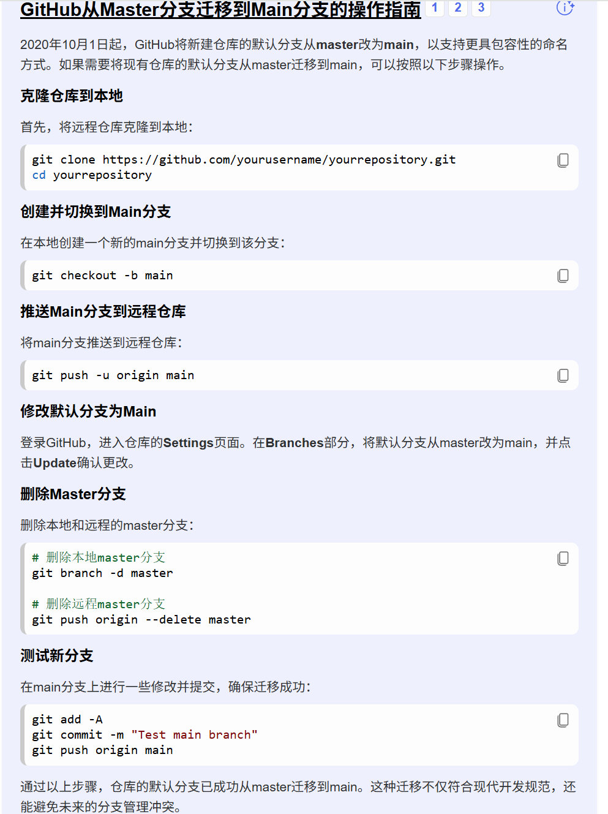

# Gitskill

## What's the function of the repositories?

I want this to keep a journal of how I learn to use git and how I learn markdown. And keep some notes to remind me of some commands.

### Where I learn git from?

[How to use git](https://liaoxuefeng.com/books/git/introduction/index.html)

## some basic methods about git

> * git init
>
> * git add <文件名>
> * git commit -m "注释"
> * git remote add origin git@github.com:[*仓库链接*(用户名称/项目.git)] such as michael20070814/learning. git
> * git push origin master(分支名)

### Remote administration

#### Confirm the remote repositories address

> git remote -v

#### Remote branch



## How to clone some document to local

> ```
> git clone -b 分支名 https://github.com/用户名/仓库名.git
> ```

## How to fetch latest updates and merge to local branches

> ```
> git pull origin master
> ```

-----

## Here are some MarkDown examples.

This is the *body* of the **language**

* option 1
* option 2
* option 3
* option 4 

1. Item 1
2. Item 2
3. Item 3

This is some more body text

4. item 4
5. Item 5

- [ ] To do the math homework
- [ ] To read the book
- [ ] To study the coding

-----


> This is some great stuff
>
> Don't you like this?

`let x;int 5`

```python
input="请输入你的名字："
a=input
print("你的名字是："+a)
```

!
